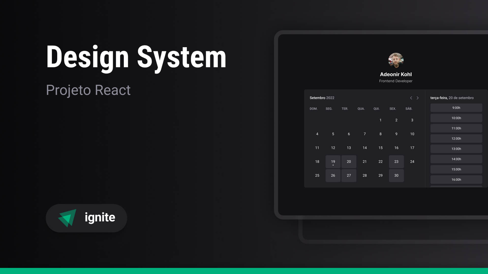

> Ignite - Projeto #6

# Ignite Call

## Sobre o projeto

Este é o projeto Ignite Call, um aplicativo de agendamento de horários baseado em calendário. Ele foi construído com várias tecnologias modernas para fornecer uma experiência de usuário suave e eficiente. Contém as seguintes funcionalidades:

- Solicita nome de usuário e nome completo para persistir no banco de dados
- Conecta com Google através de login social e solicita permissões de acesso ao calendário
- Cria agendamento usando a Google Calendar API, persistindo no banco de dados

## Tecnologias Utilizadas

> O projeto original não inclui Next.js App Router (v14), Next-Auth (v5), Tailwind CSS, DaisyUI, Eslint e Prettier

- React
- TypeScript
- Next.js
- Next-Auth
- Google Calendar API
- Tailwind CSS
- DaisyUI
- Eslint
- Prettier
- Bun
